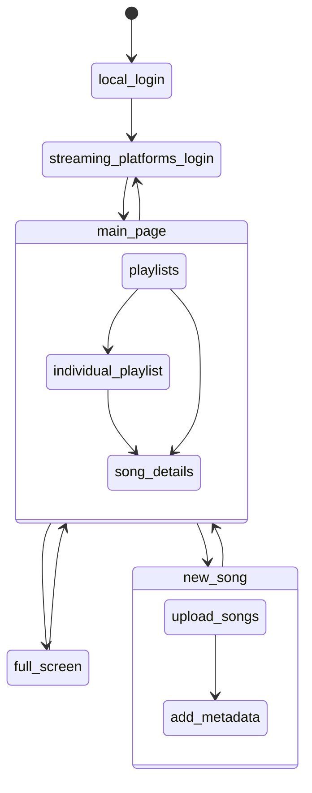

# Streaming Service Merger

This project sets out to create an app that allow users to merge
multiple streaming platforms, including files you uploaded, into
one website.

## Objectives

- Login to Tidal and Spotify, connecting to your own account
- Play music from the platforms and locally uploaded files
- Create playlists from all different platforms

### Stretch Goal

- Send music recommendations based on music played

## User flow

