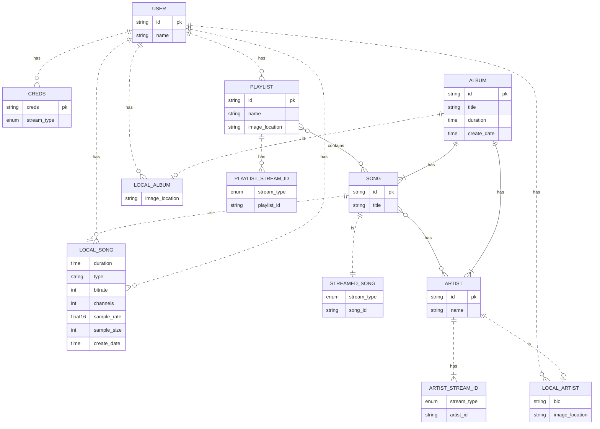

# Database Design

## Arcitecture

```mermaid
architecture-beta
    group api(cloud)[API]

    service db(database)[Database] in api
    service user_db(database)[Database] in api
    service disk1(logos:aws-s3)[S3 Bucket] in api
    service server(server)[Server] in api

    db:L -- R:server
    disk1:T -- B:db
```

## Database Tables

## Applications

### Authorisation

Sets up User table and creates views for
- User
- Credentials
- Authorisation

### Collections

Sets up table and create views for
- Playlist
- Album
- Artist
- Playlist Stream ID

### Songs

Sets up Song, LocalSong, StreamedSong and create views for
- Songs
- Local Song
- Streamed Song